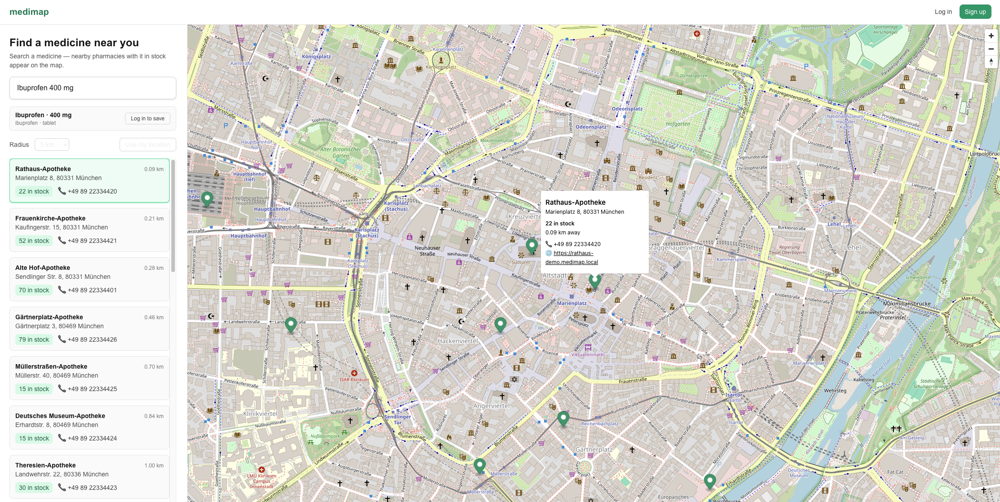

# medimap

Real-time medicine availability map. Consumers search for a medicine and see nearby pharmacies that currently have it in stock. Pharmacies maintain their inventory through a dashboard.



## Layout

```
medimap/
├── frontend/          # Next.js + TypeScript + MapLibre GL
├── backend/           # Go + Gin + pgx
│   ├── cmd/server/    # main entrypoint
│   └── internal/      # config, db, auth, handlers, middleware, models
├── db/
│   ├── migrations/    # SQL migrations (golang-migrate compatible)
│   └── seeds/         # demo pharmacies + stock (Berlin & Munich)
├── docs/img/          # screenshots used in docs
├── docker-compose.yml # Postgres + PostGIS for local dev
└── .claude/           # Claude Code project config
```

## Local dev

Prereqs: Docker, Go 1.22+, Node 20+.

```bash
# Start Postgres+PostGIS
docker compose up -d

# Run backend
cd backend
cp .env.example .env
go run ./cmd/server

# Run frontend (in another shell)
cd frontend
npm install
npm run dev
```

Backend serves on `:8081` (Docker Desktop occupies `:8080` on macOS). Frontend runs on `:3000`.

## Tech

- **Frontend** — Next.js (App Router) + TypeScript + MapLibre GL + Tailwind
- **Backend** — Go + Gin, JWT auth (HTTP-only cookie), pgx v5
- **DB** — Postgres 16 + PostGIS (geospatial queries for "pharmacies near me")
- **Migrations** — golang-migrate

## Personas

- **Consumer** — searches medicines, sees them on a map, saves medicines to profile for quick re-search
- **Pharmacy** — logs in, manages its own stock (name, address, hours, medicine inventory with quantities)
